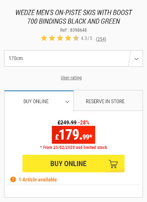

# Watchdog

Watchdog is a Node.js project to monitor product prices on eCommerce websites and be notified via Slack of price drops.

# How it works

Puppeteer crawls the products in `products.js` and fetches the prices identified via the selectors in `priceSelectors.js`. A Slack notification is sent for every product.

A product is defined as a collection of _variations_, this way it's possible to monitor similar items (typically different colours or sizes of a given product) in one go. This reduces the number of notifications sent.

# Successes
## 25 February 2020 - Skis

Bought the last pair :)

Price drop from £249.99 to £179.99 (70£ / 28%).

